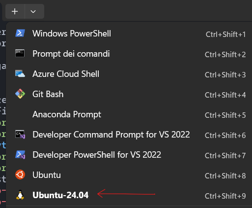
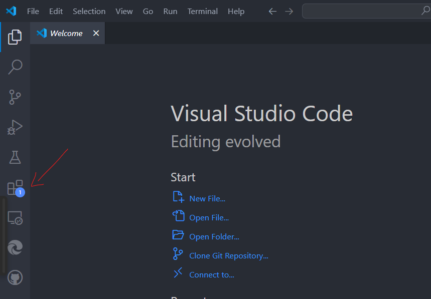
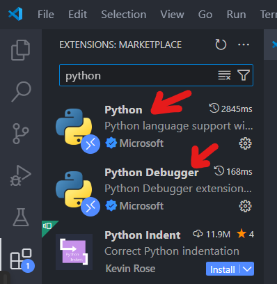

# Lesson 1

- - -
### **INZIO**

- - -
### Spiegazione Struttura Corso

#### **Obiettivi**:
>Introdurre sintassi, paradigmi e best practice di Python, dal terminale alla programmazione a oggetti.  
>Sviluppare capacità di problem-solving algoritmico, applicando strutture dati, funzioni, classi e librerie scientifiche.  
>Fornire un primo toolkit per Data Science (NumPy, Pandas, Matplotlib) e un assaggio di deep learning (PyTorch).  
>Abituare a un workflow professionale: Linux/WSL, virtual-env, VS Code, versionamento Git.  
>Potenziare soft skills: lavoro di squadra, gestione di progetto, public speaking tecnico.  
#### **Strumenti didattici**:
>**Ambiente**: WSL + Ubuntu, qualunque distribuzione Linux, macOS Terminal, VS Code con estensioni Python/Git.  
>**Stack**: Python > 3.10, gestione dipendenze, NumPy, Pandas, Matplotlib, PyTorch (intro), Markdown per i report.  
>**Metodologia**: lezioni brevi alternate a micro-challenge; sessioni hands-on; CulturePill (pillole su etica, storia e community open-source, progetti Python di esperti); seminari.
#### **Orario**:
|Giorno | Aula | Orario da-a |
 |-----------|-----------|-----------|
|06/10/2025|	2.1.1|	17:30-19:30|
|08/10/2025|	3.1.8|	17:30-19:30|
|13/10/2025|	3.1.5|	17:30-19:30|
|15/10/2025|	B.2.4|  17:30-19:30|
|22/10/2025|	3.1.8|	17:30-19:30|
|12/11/2025|	3.1.8|	17:30-19:30|
|19/11/2025|	3.1.8|	16:30-19:30|
|26/11/2025|	3.1.8|	17:30-19:30|
|03/12/2025|	3.1.8|	17:30-19:30|
> 
> **Lezione 1 (06/10)**
> [[Lezione 1 - Python Course]] 
> - Installazione WSL per chi ha windows
> - **INZIO**
> - Spiegazione Struttura Corso
> - Intervento Prof Pinoli
> - Perchè Linux
> - Installazione e Aggiornamento Terminali (Ubuntu e MAC)
> 
> **Lezione 2 (8/10)**
> - Comandi Terminali (con Mirko)
> - Visual Studio
> - Introduzione a Python
> - Python da Terminale
> 
> **Lezione 3 (13/10)**
> - Variabili
> - Commenti
> - Typecasting
>   
> **Lezione 4 (15/10)**
> - If/else/elif
> - Operazioni logiche e algebriche
> - Cenni su venv
> - Liste
> - For Loops
> - Matrici
> - Funzioni 
> - While loops
> 
> **Lezione 5 (22/10)**
> - Ambienti Virtuali: utilità, venv (creazione, attivazione, gestione dipendenze).
> - Jupyter Notebook: introduzione, installazione, utilizzo base (anche in VS Code).
> - Funzioni (approfondimento): scope, valori di ritorno multipli, *args , **kwargs , funzioni Lambda, docstring.
> - Classi (introduzione): de nizione ( class ), costruttore __init__ , attributi, metodi, istanze.
> - Iteratori: concetto ( __iter__ , __next__ ), utilità.
> - NumPy (introduzione): ndarray , vettorizzazione, broadcasting, creazione array, operazioni base, slicing, indicizzazione Classi 2
> - Error Handling
> - File esterni
> - Creare una Libreria
> - Culture Pill/esterni
> 
> **Lezione 6 (12/11)** 
> - Iteratori (approfondimento): creazione personalizzata, Generatori ( yield ), funzioni map(), filter() , zip().
> - Ereditarietà nelle Classi: concetto, vantaggi, super() .
> - Esercizio sulle Classi: implementazione classe Studente .
> - File Handling (cenni).
> - Error Handling (Gestione degli Errori): SyntaxError vs Exceptions , AssertionError, raise Exception , assert , blocco try...except...else...finally
> 
> **Lezione 7 (19/11)**
> - Programmazione Orientata agli Oggetti (OOP): esercizio su gerarchia di classi ( Persona , Esame , Studente ).
> - Pandas:
> - Data Wrangling: importazione, pulizia, ristrutturazione, ltraggio, aggregazione, unione dati.
> - Gestione File: CSV, Excel, JSON.
> - NumPy (approfondimento):
> - Concetti: dtype , vettorizzazione, broadcasting, shape, axes.
> - Operazioni: indicizzazione avanzata, masking, trasposizione, ordinamento, concatenazione, aggregazione.
> - Matplotlib (Introduzione alla Visualizzazione) (se non si nisce va nella lezione buffer):
> - Gerarchia oggetti ( Figure , Axes ), approccio statico vs. orientato agli oggetti.
> - Creazione gra ci multipli, personalizzazione, integrazione con Pandas
> **Lezione 8 (26/11)**
> - Concetti Fondamentali di Deep Learning: Spiegazione dei vari algoritmi, applicazioni e di dove sicolloca all'interno del Machine Learning.
> - Introduzione alle reti neurali, percettrone, rete neurale, forward and backward propagation, Gradient Descent (intuitivamente), preparazione dei dati divisione del dataset.
> - Introduzione a PyTorch e Torchvision: installazione, dataset, trasformazioni.
> - Preparazione Dati: torchvision.transforms , torchvision.datasets.CIFAR10 , DataLoader .
> - Visualizzazione Dati con matplotlib .
> - Definizione Rete Neurale Convoluzionale (CNN): nn.Module , nn.Conv2d , nn.MaxPool2d , nn.Linear , metodo forward .
> - Funzione di Perdita ( nn.CrossEntropyLoss ) e Ottimizzatore ( torch.optim.SGD ).
> - Addestramento Rete: ciclo epoche, forward/backward pass, aggiornamento pesi.
> - Salvataggio e Test del Modello: torch.save , load_state_dict , calcolo accuratezza.
> - Cenni su addestramento GPU e layer Conv2d .
> - Mini tutorial su Git e GitHub: init , add , commit , push , README.md .
> **Lezione 9 (03/12)**
> - Presentazione Progetti Finali: MVP o idee progettuali dettagliate.
> - Valutazione Progetti e "Premiazione".
> - Consegna Progetto come requisito per attestato.
> - Riflessioni finali, risorse per apprendimento continuo.
 Saluti e raccolta feedback sul corso

Progetto finale in Pytorch

Tempistiche (potremmo sforare)
## Intro (20 min)

1) *Cos’è Python*  
Python è un linguaggio di programmazione interpretato, multi-paradigma e ad alto livello. È apprezzato per la sua sintassi pulita e leggibile, che lo rende un’ottima scelta sia per principianti sia per sviluppatori esperti. In Python puoi scrivere script veloci per prototipare un’idea o sviluppare progetti di grandi dimensioni grazie alla sua vasta libreria standard e al supporto di numerosi framework.

2) *Cosa significa interpretato?* 
in un linguaggio compilato (es. C, C++) il codice sorgente viene tradotto interamente in linguaggio macchina (generando un file eseguibile) *prima* dell’esecuzione, tramite un compilatore. Il risultato è un file binario, veloce ma meno portabile.
In un linguaggio interpretato(es. Python, JavaScript), invece, il codice viene tradotto e eseguito riga per riga da un interprete. Non richiede compilazione preventiva, è più portabile e flessibile (Un programma C deve essere ricompilato per ogni sistema operativo, mentre uno script Python gira ovunque ci sia l’interprete), ma generalmente più lento.
*Puoi pensare alla differenza tra un compilatore ed un interprete in informatica come alla differenza tra un traduttore e un interprete linguistico: Il primo prende un'intera opera, la traduce per iscritto in una seconda lingua e la riconsegna all'editore, il quale la distribuisce a suo piacimento al pubblico che parla questa seconda lingua. Se però vi sono errori e la traduzione non ha successo l'editore dovrà rispedire il manoscritto intero al traduttore. Un interprete invece "doppia" frase per frase ciò che dice l'intervistato. Se commette un errore può correggersi immediatamente ripetendo la parola/frase errata, inoltre può adattare la lingua della traduzione alla sua audience. Tuttavia la traduzione è meno scorrevole (ricca di "ehm", pause, imprecisioni etc).*

3) *Perché Python*  
• **Semplicità e velocità di sviluppo**: La sintassi chiara e la ricca collezione di librerie permettono di realizzare progetti in meno tempo rispetto ad altri linguaggi.  
• **Comunità e risorse**: Python ha un’enorme community di sviluppatori, quindi è facile trovare guide e risolvere problemi, soprattutto nei campi più specialistici come la scienza dei dati e la bioinformatica.  
• **Versatilità**: Python si usa in tantissimi ambiti, dal web development (Django, Flask), all’analisi dati e Machine Learning (pandas, NumPy, scikit-learn, PyTorch), fino ad applicazioni embedded (seppure meno frequenti).  
• **Integrazione con altri linguaggi**: Python può interfacciarsi con librerie in C/C++ e Java, sfruttando così performance e compatibilità già esistenti.
Le sue strutture dati integrate di alto livello, combinate con il tipizzazione dinamica (cioè il tipo di una variabile viene determinato durante l’esecuzione) e il binding dinamico, lo rendono molto attraente per lo Sviluppo Rapido di Applicazioni (RAD), nonché per l’uso come linguaggio di scripting o “collante” per collegare componenti esistenti. La sintassi semplice e facile da imparare di Python enfatizza la leggibilità e riduce quindi i costi di manutenzione del programma.
Python funge da “colla” che delega certe funzioni a pacchetti scritti in C.
Python supporta moduli e pacchetti, che favoriscono la modularità del programma e il riutilizzo del codice. L’interprete Python e l’estesa libreria standard sono disponibili in forma sorgente o binaria senza costi per tutte le principali piattaforme e possono essere liberamente distribuiti.
4) *Come Python*  
• **Installazione:** In ambiente Linux/Ubuntu, è spesso pre-installato o facile da aggiungere tramite apt-get. In macOS si può installare con Homebrew o scaricando il pacchetto ufficiale, mentre in Windows è necessario scaricarlo dal sito ufficiale o tramite Microsoft Store (o usare WSL, come previsto dal corso).  
• **Utilizzo:** Puoi scrivere i tuoi script in un qualsiasi editor di testo, avviarli da riga di comando (python script.py) oppure usare un IDE come Visual Studio Code, PyCharm o anche Jupyter Notebook per analisi interattive.  
• **Virtual Environment:** In Python è raccomandabile gestire le dipendenze con virtual environment (venv) o ambienti conda, soprattutto se hai progetti diversi che richiedono versioni di librerie non compatibili fra loro.

5) *Esempi di Python in ambito biomedico*  
• **Analisi di dati clinici**: Python è molto utilizzato per analizzare dataset di pazienti, estrarre statistiche grazie a librerie di data science e anche per la creazione di modelli di Machine Learning in ambito diagnostico o predittivo (ad esempio, previsione di complicanze post-operatorie).  
• **Elaborazione di immagini medicali**: Con OpenCV, SimpleITK o librerie di deep learning, si possono processare immagini di TAC, risonanze magnetiche o radiografie. Python facilita la prototipazione rapida di algoritmi per la segmentazione o il riconoscimento di patologie.  
• **Modellazione e simulazioni:** Per la modellazione computazionale di processi biologici (dalla struttura proteica fino alla cinetica di farmaci), esistono librerie in Python che semplificano la creazione e il test di modelli matematici e statistici.  
• **Bioinformatica:** Librerie come Biopython aiutano nell’analisi di sequenze di DNA/RNA, nell’interazione con database di proteine e di geni e nel parsing di formati di file standard come FASTA, GenBank, ecc.


6) *Pro e contro di Python*  
- Punti di forza:  
	- Facile da imparare e molto leggibile, ideale per prototipazione rapida.  
	- Eccellente ecosistema di librerie (soprattutto per data science e bioinformatica). 
	- Community e documentazione vastissime, risolve i problemi più comuni in modo immediato.  
  
- Limiti e svantaggi:  
    - **Performance**: Python è solitamente più lento di C++ o Java. In molti casi, tuttavia, questo deficit si supera accedendo a librerie ottimizzate in C/C++ (la parte più pesante gira in nativo, mentre Python funge “solo” da interfaccia).  
    - **Non è il più adatto agli ambienti embedded con memoria molto ridotta**, anche se esiste MicroPython per dispositivi particolarmente limitati.  
    - La gestione dell’ambiente (versioni e dipendenze) può diventare complessa se non ci si organizza bene, soprattutto quando si lavora su più progetti contemporaneamente.

In sintesi, Python si rivela un linguaggio flessibile, potente e molto comprensibile, con una curva di apprendimento amichevole e un ecosistema di strumenti concepiti per la ricerca scientifica e il settore biomedico.


#### Documentazione ufficiale
>Stack Overflow
>Siti vari
>ChatGPT (rischia di rendere frustrante l’apprendimento e di creare problemi in seguito, ricompensa a breve termine)
## Setup (60 min)

[[Programming Tools and Python Installation Guide]]
### Windows

**Installare wsl:**

Usa una versione leggermente diversa da quella che abbiamo visto noi. Provare a seguire il tutorial dall'inizio in caso di problemi. Prima di arrendersi al proprio destino provate a riavviare il computer, a molti ha risolto i problemi.
https://learn.microsoft.com/en-us/windows/wsl/install


**Installare python:**

```bash
sudo apt install python3
```

Controllare se l'installazione è avvenuta correttamente:
```bash
python3 -V
```
Si dovrebbe ottenere un output del tipo:
```
root@host:~# python3 -V
Python 3.12.3
```

In caso di problemi consultare il seguente link e seguire [procedure alternative](https://www.rosehosting.com/blog/how-to-install-python-on-ubuntu-24-04/).

### MAC OS
- Installare Homebrew
	(non fatto assieme ma consigliato, consente di installare pacchetti da terminale come in Linux. Potrebbe essere necessario farlo nelle lezioni finali)
	https://iboysoft.com/howto/install-homebrew-on-mac.html

- Installare python
	Seguire la sezione 5.1.1 di questo tutorial, non andare oltre.
	https://docs.python.org/3/using/mac.html#installation-steps

### Perchè Linux

- Perchè per progetti embedded si userà quello
- perchè è il più versatile
- perchè è uno standard
- perchè ha una curva di apprendimento più difficile ed è meglio affrontarlo con qualcuno, da soli ci si trova disorientati.

- Nel campo biomedico, molti dispositivi e strumenti diagnostici implementano sistemi operativi Linux, sfruttandone la stabilità e la versatilità.
- L'ecosistema open-source di Linux offre grande trasparenza e possibilità di personalizzazione, una caratteristica importante per la ricerca.

**Esempi di linux in ambito biomedico**

1) Sistemi di analisi e modellazione di dati clinici su Linux in ambiente HPC (High Performance Computing)  
	- In un laboratorio di ricerca biomedica, capita di dover processare grandi moli di dati, come immagini di risonanza magnetica (MRI), dati di genomica o sequenziamenti di DNA (NGS). Per elaborare questi dataset in modo efficiente, si utilizzano server Linux dotati di GPU e altre risorse ad alte prestazioni.  
	- I software bioinformatici più usati (ad esempio, diversi tool per l’analisi del DNA e dell’RNA) sono spesso sviluppati o ottimizzati per Linux, il che riduce problemi di compatibilità e aumenta la stabilità dell’ambiente di lavoro.  
	- La facilità di automazione (tramite script Bash o Python) rende Linux molto adatto a pipeline complesse di analisi, in cui i dati passano attraverso vari passaggi (pulizia, filtraggio, allineamento, analisi statistica, ecc.).

2) Utilizzo di Raspberry Pi o sistemi embedded basati su Linux per dispositivi di monitoraggio o analisi diagnostica  
	- Un Raspberry Pi o un’altra scheda embedded (come BeagleBone, Jetson Nano, o simili) può essere impiegato come cervello “low cost” di piccoli dispositivi biomedici, ad esempio per monitorare parametri vitali di un paziente.
	- Nel campo della telemedicina, un sistema embedded Linux può raccogliere dati tramite sensori (pressione arteriosa, battito cardiaco, temperatura corporea) e inviarli in modo sicuro a un server remoto, permettendo un monitoraggio costante anche fuori dall’ospedale.  
	- Grazie alla natura open-source di Linux, è possibile customizzare il sistema operativo e installare soltanto ciò che serve, ottimizzando prestazioni e consumo energetico. Questo risulta prezioso se il dispositivo deve funzionare a batteria o in contesti con risorse limitate.

3) Laboratori di ricerca che gestiscono grandi volumi di dati (sequenziamento del DNA, elaborazione di immagini mediche) con software ottimizzati per Linux  
	 - I laboratori che si occupano di genomica, proteomica o imaging biologico utilizzano software specializzati (come BLAST, Bowtie, GATK per genetica, oppure ANTs, FSL per neuroimaging). Questi tool sono spesso nativi per Linux o vantano performance migliori su Linux grazie a dipendenze e librerie ottimizzate.  
	- In molti casi, i laboratori dispongono di cluster di calcolo interni o si appoggiano a servizi cloud – quasi sempre basati su distribuzioni Linux – per eseguire analisi a elevato carico computazionale.  
	- Lavorare in Linux semplifica anche l’automazione di processi ripetitivi (con cron job, script Bash/Python, container Docker, ecc.), un vantaggio notevole in pipeline sperimentali lunghe e cicliche.

In sintesi, i punti chiave sono l’elevata efficienza, la flessibilità e la stabilità che Linux offre in molti settori biomedici: dalla ricerca di base (analisi bioinformatiche, HPC) allo sviluppo di piccoli dispositivi embedded e strumenti di telemedicina.

**Cos'è ubuntu**

Ubuntu è una distribuzione Linux particolarmente user-friendly e diffusa, ideale per chi desidera avvicinarsi al mondo Linux. Offre un ciclo di aggiornamenti stabile, un vasto supporto della community e un’ampia disponibilità di software precompilato, inclusi molti strumenti bioinformatici.


## Linux Commands 101

Questa sezione è una guida rapida ai comandi base di Linux. Gli esempi sono pensati per essere eseguiti in sequenza, utilizzando un file `prova.txt` che creeremo e modificheremo.

**`pwd` (Print Working Directory):** Mostra il percorso completo della cartella in cui ti trovi attualmente. È utile per orientarsi.
```bash
pwd
```

**`ls` (List):** Elenca tutti i file e le cartelle presenti nella directory corrente.
```bash
ls
```

**`mkdir` (Make Directory):** Crea una nuova cartella. Creiamone una per i nostri esperimenti.
```bash
mkdir appunti_python
```

**`cd` (Change Directory):** Ti permette di spostarti tra le cartelle. Entriamo nella cartella appena creata.
```bash
cd appunti_python
```

**`touch`:** Crea un file vuoto. Se il file esiste già, ne aggiorna la data di modifica. *N.B. il comando* touch *non è stato pensato per questo scopo ma nomerosi comandi del terminale Ubuntu vengono comunemente utilizzati per il loro* side effect
```bash
touch prova.txt
```

**`echo`:** Scrive una stringa di testo. Usando `>` possiamo "redirezionare" l'output e scrivere il testo dentro un file (sovrascrivendolo).
```bash
echo "Questa è la prima riga." > prova.txt
```

**`cat` (Concatenate):** Mostra il contenuto di uno o più file. Verifichiamo cosa abbiamo scritto.
```bash
cat prova.txt
```
*è pensato per essere utilizzato con più file con questa sintassi* 
```bash
cat file1 file2 
```
*La possibilità di usarlo per visualizzare un file è un altro, utile, side effect*
 
**`echo` con `>>`:** A differenza di `>`, il doppio `>>` aggiunge il testo alla fine del file, senza cancellare il contenuto esistente.
```bash
echo "Questa è la seconda riga." >> prova.txt
cat prova.txt
```

**`cp` (Copy):** Copia un file. Creiamo una copia di backup.
```bash
cp prova.txt backup_prova.txt
```

**`mv` (Move):** Sposta o rinomina un file. Rinominiamo il nostro file originale.
```bash
mv prova.txt note_importanti.txt
```
>*Siamo di fronte ad un altro esempio di side effect: move è pensato per spostare un file in una nuova cartella con questa sintassi:*
```bash
mv nome_file_originale cartella_target/nuovo_nome_file
```
>*Non specificando la cartella target lo si può usare per modificare il nome del file. Si può anche utilizzare senza specificare il nuovo nome del file, in questo caso l'effetto è uno spostamento senza variazione del nome del file*

**`rm` (Remove):** Rimuove (cancella) un file. Facciamo attenzione, perché non c'è un cestino!
```bash
rm backup_prova.txt
```

**`cd ..`**: Comando speciale per tornare alla cartella "genitore" (quella che contiene la cartella attuale).
```bash
cd ..
```

**`rmdir` (Remove Directory):** Rimuove una cartella, ma solo se è vuota. Prima svuotiamola e poi cancelliamola.
```bash
rm appunti_python/note_importanti.txt
rmdir appunti_python
```
>*è anche possibile sfruttare il comando rm per rimuovere una directory e i file al suo interno, in questo caso è necessario specificarlo con un -l
```bash
rm -l appunti_python
```

**`man` (Manual):** Mostra il manuale di un comando, spiegando come funziona e quali opzioni ha. Per uscire, premi `q`.
```bash
man ls
```

**`sudo` (Super User Do):** Esegue un comando con i privilegi di amministratore. È necessario per operazioni di sistema, come installare software.
```bash
sudo apt-get update
```
#### Gestione dei pacchetti
- - -
Come gestire i pacchetti software da command line. 

>[! warning] Attenzione!
>Per chi usa mac è necessario aver installato homebrew!

| **apt-get Command**              | **Description**                                                                                    | **Homebrew Equivalent**         |
| -------------------------------- | -------------------------------------------------------------------------------------------------- | ------------------------------- |
| `apt-get update`                 | Fetch and update the package lists from repositories                                               | `brew update`                   |
| `apt-get install <package-name>` | Install a specific package                                                                         | `brew install <package-name>`   |
| `apt-get remove <package-name>`  | Remove a specific package without removing its configuration files                                 | `brew uninstall <package-name>` |
| `apt-get purge <package-name>`   | Remove a specific package and its configuration files                                              | `brew uninstall <package-name>` |
| `apt-get upgrade`                | Upgrade all packages to the newest available version                                               | `brew upgrade`                  |
| `apt-get autoremove`             | Remove packages that were automatically installed to satisfy dependencies and are no longer needed | `brew cleanup`                  |
| `apt-get clean`                  | Clear downloaded archive files                                                                     | `brew cleanup`                  |
| `dpkg -l`                        | List all installed packages                                                                        | `brew list`                     |
| `apt-cache search <term>`        | Search for a package by its name or description                                                    | `brew search <term>`            |
|                                  |                                                                                                    |                                 |


## Visual studio code (20 min)
**Windows**
1. Installa [Visual Studio Code](https://code.visualstudio.com/Download).
2. Cerca il terminale (`Windows + S`)
	
3. Scegli ubuntu 2024-4.1 LTS dal menù a tendina
	
4. Vai nella cartella python course:
	`cd python_course`
5. Avvia visual studio code in quella cartella
	`code .`
	Dovrebbe partire un download di un server che connette visual studio code a wsl, in questo modo visual studio code gira su windows modificando i dati in Linux 

6. Cliccare nella barra a sinistra sull'icona estensioni 

7. Cercare python nella barra di ricerca ed installare le seguenti estensioni


8. Crea un nuovo file .py
9. eseguilo da VScode
10. Nota che si può accedere al terminale da VScode alzando la tendina in fondo alla videata

**MAC**

1. [Scarica Visual Studio Code](https://go.microsoft.com/fwlink/?LinkID=534106) per macOS.
2. Apri l'elenco dei download del browser e individua l'app o l'archivio scaricato.
3. Se è un archivio, estrai il contenuto. Usa il doppio clic per alcuni browser o seleziona l'icona della 'lente d'ingrandimento' con Safari.
4. Trascina `Visual Studio Code.app` nella cartella **Applicazioni**, rendendolo disponibile nel Launchpad di macOS.
5. Apri VS Code dalla cartella **Applicazioni**, facendo doppio clic sull'icona.

Puoi anche eseguire VS Code dal terminale digitando 'code' dopo averlo aggiunto al percorso:
- Avvia VS Code.
- Apri la **Command Palette** (Cmd+Shift+P) e digita 'shell command' per trovare il comando **Shell Command: Install 'code' command in PATH**.
undefined
- Riavvia il terminale affinché il nuovo valore `$PATH` abbia effetto. Potrai digitare 'code .' in qualsiasi cartella per iniziare a modificare i file in quella cartella.

> **Nota:** Se hai ancora il vecchio alias `code` nel tuo `.bash_profile` (o equivalente) da una versione precedente di VS Code, rimuovilo e sostituiscilo eseguendo il comando **Shell Command: Install 'code' command in PATH**.

[Se non funziona, provare a copiare ed incollare nel terminale questi comandi](https://code.visualstudio.com/docs/setup/mac#_alternative-manual-instructions).


6. Cliccare nella barra a sinistra sull'icona estensioni 

7. Cercare python nella barra di ricerca ed installare le seguenti estensioni

8. Crea un nuovo file .py
9. eseguilo da VScode
10. Nota che si può accedere al terminale da VScode alzando la tendina in fondo alla videata
